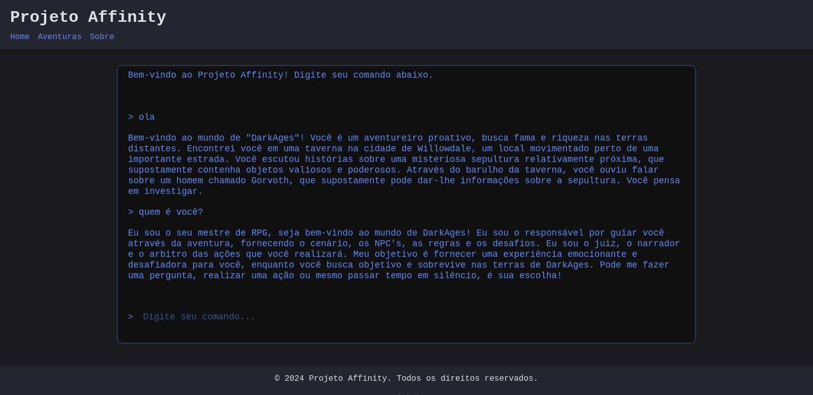

# project-affinity



Seja bem vindo Ao Projeto Affinity!

Jogue RPG de mesa com a I.A LLAMA 3 no mundo de DarkAges (Futuramente haverá outros mundos), utilizando a API gratuita de groq ou servindo o seu próprio modelo de linguagem (futuramente).


[todo.md](./todo.md)

## Instalação e compilação

### Instale o node
https://nodejs.org/en/download/package-manager

### Instale o projeto
```sh
git clone https://github.com/vinzent01project-affinity
cd project-affinity
npm install . 
```

### Adquira uma api do grok (gratuito)
crie uma conta em https://groq.com 

crie uma nova api kei em https://console.groq.com/keys

crie um arquivo .env com o seguinte conteúdo na pasta raiz

```
GROQ_API_KEY=sua-api-aqui
```

### Compilação

```
npm run build
```

### Iniciar
```
npm run start
```

abra seu navegador e navegue para https://localhost:3000

## Desenvolvimento

durante o desenvolvimento os arquivos de ./src será compilados para ./build

```
npm run dev

```

## Me ajude
qualquer doação me ajuda a continuar criando e mantendo novos projetos

<a href='https://ko-fi.com/A0A017UJGV' target='_blank'></a>


